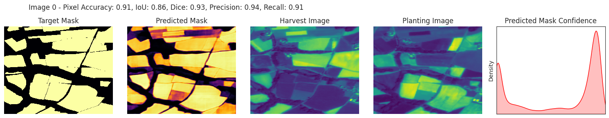
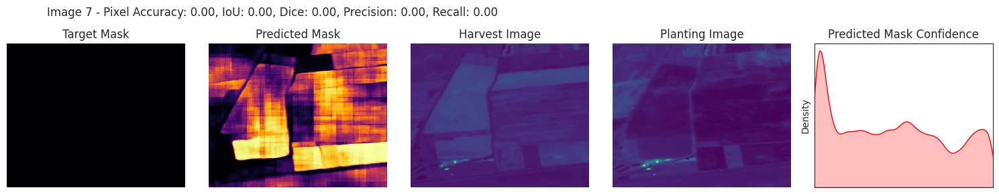

# LoFi: Lots of Field Instances

Accurate Field Boundary Delineation with Geolocation-Enhanced Semantic Segmentation: This work highlights the critical importance of field boundary delineation in various geospatial applications, including precision agriculture, land administration, environmental monitoring, and policy research. Precise field boundaries empower stakeholders to optimize resource allocation, manage land ownership, enforce environmental regulations, and inform policy decisions.

To address this challenge, we propose a deep-learning model for field boundary delineation. Our model incorporates a Geo-CLIP location encoder fused with a Vanilla UNET architecture for semantic segmentation. The location encoder injects valuable geolocation features into the U-Net at the bottleneck, enhancing the model's ability to leverage spatial context during segmentation.
The combination of the Geo-CLIP location encoder and this comprehensive dataset (totaling 54,119 image patches) has the potential to improve the accuracy of field boundary delineation tasks significantly. Project code and other implementation details are available at https://github.com/aninda-ghosh/lofi

# Model Architecture

The Model is a combination of Vanilla UNET with Geo-CLIP's (https://github.com/aninda-ghosh/geo-clip-paper-implementation) Location Encoder

# Dataset

## Countries vs Image Patch Counts

# Results

## Semantic Segmentation Results (Quantitative)

|  Architecture  |  IoU (Mean %)  |  Dice Coefficient (Mean %)  |  Precision (Mean %)  |  Recall (Mean %)  |   
|  ------------  |  ------------  |  -------------------------  |  ------------------  |  ---------------  |
|  Vanilla UNET  |  55.83         |  63.25                      |  61.32               |  73.78            |
|  LoFi          |  56.48         |  63.62                      |  60.91               |  75.26            |

## Semantic Segmentation Results (Qualitative)

### Image 0

### Image 6

### Image 7

# Observation

The quantitative analysis yielded minimal discrepancies due to the simplistic post-processing method employed to generate binary segmented masks. Essentially, I computed the mean of prediction scores from the sigmoid layer for mask generation. However, Figures 0 and 7 showcase confidence scores from the final output layer for both models, revealing a notable contrast, particularly in the vivid yellow hues denoting high confidence in the LoFi model outputs. Notably, Figure 7 underscores the proximity of predicted mask logits to the target mask.

These qualitative findings offer two plausible explanations:

- Geographic data appears to furnish valuable insights into image terrain or specific field attributes corresponding to geographic locations.
- The dataset may harbor inherent biases stemming from the annotation process, given its curation from publicly accessible websites of a location-specific agency. Consequently, incorporating location embeddings seems to amplify such features within the model's output.

# Acknowledgements

@inproceedings{geoclip,
  title={GeoCLIP: Clip-Inspired Alignment between Locations and Images for Effective Worldwide Geo-localization},
  author={Vivanco, Vicente and Nayak, Gaurav Kumar and Shah, Mubarak},
  booktitle={Advances in Neural Information Processing Systems},
  year={2023}
}